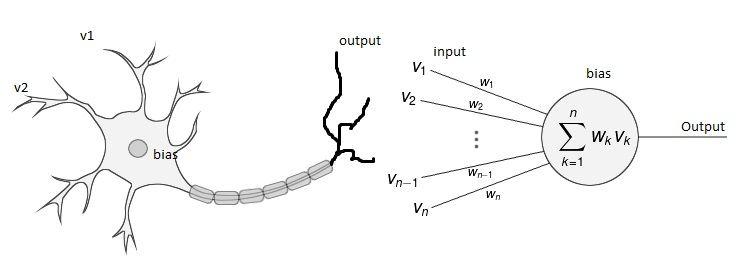

# Basic AI Questions
This is a compiled overview and an attempt to answer all of the quesations in the following [sample sheet](https://datsoftlyngby.github.io/soft2020spring/resources/d67f51f7-AIBasicQuestions.pdf).

## Overview
1. [What does AI stand for?](#1)
2. [What is an Agent?](#2)
3. [How can AI be implemented in games?](#3)
4. [Which AI branches are you familiar with?](#4)
5. [What is Machine Learning?](#5)
6. [Tasks solved by machine learning](#6)
7. [Describe the process of ML](#7)
8. [Supervised and unsupervised learning](#8)
9. [Which data structures are used for ML?](#9)
10. [What is Gaussian distribution?](#10)
11. [In ML what is a feature and a label?](#11)
12. [Lack of data](#12)
13. [What is a scatter plot](#13)
14. [Model Bias and lack of variance](#14)
15. [What is the difference between a method and a model?](#15)
16. [Which machine learning libraries and frameworks are you familiar with and which functions do they provide?](#16)
17. [Compare classification and regression, give examples of appropiate cases for both](#17)
18. [Decision tree is a method for prediction based on the metaphore of a tree explain how this tree is build.](#18)
19. [Greedy algorithm makes the optimal choice at each step of building the	decision tree. What is considered optimal choice or best classifier by the	method?](#19)
20. [What is entropy? How to intepret low and high values?](#20)
21. [When is a decision tree not good to use?](#21)
22. [In	Regression,	we	search	for	a	function	that	best	represents	the	relation	between	the	input	and	the	output.	If	the	input	sequence	is,	for	example,	x	=	{1,	4,	3,	5,	2},	and	the	output	sequence	is	y	=	{3, 9,	7,	11,	5},	which	function	would	be	appropriate?](#22)
23. [which method is based on probabilities, is it supervised, explain the logic](#23)
24. [if you program a robot that has to sort out big potatoes from small ones, which method would you use.](#24)
25. [What is clustering in machine learning? Name some methods for clustering and how they differ.](#25)
26. [How would you test the validity of the model you have created, if the accuracy of a model is not good enough what would you improve?](#26)
27. [GIGO is one the most important metaphoric principles in machine learning. What is it associated with?](#27)
28. [What is clean data and bad data? give examples and how to improve bad data](#28)
29. [If the training data set contains missing values, can it still be used would you modify data and if yes how?](#29)
30. [If there are too many features of objects availablehow would you decide which are more valuable than others.](#30)
31. [How	do	we	measure	the	quality	of	a	model?](#31)
32. [What	is	cross-validation	and	in	which	cases	it	is recommended for use?](#32)
33. [Neural	Network	is	a	metaphor	from	neurology	used	in	machine learning.	How	does	a	neuron	relate	to	a	model?	Draw	a	sketch	to	illustrate	your	meaning.](#33)
34. [What	is	the	difference	between	perceptron and	deep	neural	network?	Do	you	get	better results	by	using	deep	neural	network,	compared	to	other	methods?	Why?](#34)
35. [Explain	the	back	propagation	of	errors	in	an	artificial	neural network.](#35)
36. [What	is	an	activation	function,	how	does	it	affect	the	work	of	a	neuron?	Which	are	the	most	common	functions	used	as	activation	functions?](#36)
37. [What	is	a	convolutional	neural	network?		What	kind	of	tasks is	it	good	for	solving? How	does	it	differ	from	any	other	type	of	ANN?](#37)
38. [Are	you	familiar	with	any	technique,	used	in	processing	text	in	natural	language?	Which?](#38)
39. [How	does	a	recommender	system	work?	Explain	some	of	the	approaches,	used	for	generating	recommendations	by	AI	instruments.](#39)
40. [What	is	TensorFlow?	Where	does	it	get	its	name	from?	Which	are	its	application	areas? What	is	Keras?	How	do TensorFlow	and Keras	contribute	to	the	AI	development	process?](#40)

## What does AI stand for? [1]
> What	does	AI	stand	for?	Give	you	own	explanation	of	the	meaning	of	it. What is	known as Turing test?

AI stands for [Artificial Intelligenc](https://en.wikipedia.org/wiki/Artificial_intelligence).

As the name implies it's simulating, or emulating something that's intenlligent, but nessecarily isn't in reality.

>Artificial Intelligence (AI) is a “a huge set of tools for making computers behave intelligently” and in an automated fashion. This includes including voice assistants, recommendation systems, and self-driving cars.   [Source](https://www.datacamp.com/community/blog/ai-and-ml?utm_source=adwords_ppc&utm_campaignid=9942305733&utm_adgroupid=100189364546&utm_device=c&utm_keyword=&utm_matchtype=b&utm_network=g&utm_adpostion=&utm_creative=332602034352&utm_targetid=aud-299261629574:dsa-929501846124&utm_loc_interest_ms=&utm_loc_physical_ms=9067633&gclid=CjwKCAjw_LL2BRAkEiwAv2Y3SUl0t4sqlwiVQCtwfN7q20dXCc_gvn__wQLHL2MVS4YZZYbab5Wk0xoCb00QAvD_BwE)

[The turing test](https://en.wikipedia.org/wiki/Turing_test) is a test that is developed to determine whether a machine has human like intelligence or not. The test essentially boils down to a human being communicating with a machine, without knowning beforehand whether its a machine or not. With that in mind the human has to determine if he or she is communicating with a machine or a human being. The test subjects, i.e the machine and the human, has to be apart, so the human can't visibly tell whether or not it's a machine or not based on physical appearance.

[Back to overview](#overview)

### What is an Agent? [2]
>What	is	an	intelligent agent	in	the	context	of	AI? Which	are	its	components?

An <b>[agent](https://www.youtube.com/watch?v=XO6SV0Mup1E)</b> is anything that can be viewed as perceiving its environment through sensors and acting upon that enviroment through actuators or motors.

An example would be:
A human has eyes, ears and other organs which are sensors, i.e "tools" that are used to percieve the enviroment.
A human also has hands, legs, arms, which are actuators, i.e "tools" used to act upon what is percieved in the enviroment.

Relating that to sowftware:
Keystrokes, recieving network packets, cameras, bluetooth, etc. would be sensors that it can act upon by displaying content, sending network packets, writing files based on that input.

It can be illustrated the following way:

[Back to overview](#overview)

## How can AI be implemented in games? [3]
>How	can	AI	be	implemented	in	games?	Name	some	principles,	methods	and	algorithms	
applied	by	AI agents	in	playing	games.

Historically AIs has been applied to games for ever. They work based in more constrained enviroments, for example in turn based games, but modern AIs also excel at much more complex games. There are specially great discoveries made in the MOBA genre.

Chess fits above description very well, and has had AI available for a while. The agent can given the ruleset of the game, make a descission on a legal move. Furthermore an advanced agent will be able to make a "good" move based on its sensors, using it acuators.

[Back to overview](#overview)

## Which AI branches are you familiar with? [4]
>Which	AI	branches you	are	familiar	with? Give	examples	of	AI	application	areas.

Games, text recognition, speech recognition, image recognition, google in general have massive AIs predicting optimal routes in traffic, utilizing google maps, all of the above apply to many indstirues and business sectors. Comercials and SoMe in general also heavily utilizes AI to for target branding.

[Back to overview](#overview)

## What is Machine Learning? [5]
>What	is	machine learning? Give you own	explanation	of	the	meaning	of	it. Compare	it	to deep learning.

Machine learning is the concepts of a machine "learning" from the input its givin. This can be done by "training" a machine. In principle this often means that you give a machine x amount of data, but hold back y amount of data. Use one or more approiate algorithm(s) for a given task, and let the machine learn from the x data, and finally compare the machines results to y data. Then there are several metrics and parameters that can be used to describe whether or not the machine learned anything valueable. If not algorithm or data paramters can be tweaked for further experimentation.

>Machine Learning (ML) is the “field of study that gives computers the ability to learn without being explicitly programmed.” The lion’s share of ML involves computers learning patterns from existing data and applying it to new data in the form of making predictions, such as predicting whether an email is spam or not, whether a customer will churn or not, and diagnosing a particular piece of medical imaging.   [Source](https://www.datacamp.com/community/blog/ai-and-ml?utm_source=adwords_ppc&utm_campaignid=9942305733&utm_adgroupid=100189364546&utm_device=c&utm_keyword=&utm_matchtype=b&utm_network=g&utm_adpostion=&utm_creative=332602034352&utm_targetid=aud-299261629574:dsa-929501846124&utm_loc_interest_ms=&utm_loc_physical_ms=9067633&gclid=CjwKCAjw_LL2BRAkEiwAv2Y3SUl0t4sqlwiVQCtwfN7q20dXCc_gvn__wQLHL2MVS4YZZYbab5Wk0xoCb00QAvD_BwE)

[Deep learning](https://www.datacamp.com/community/blog/ai-and-ml?utm_source=adwords_ppc&utm_campaignid=9942305733&utm_adgroupid=100189364546&utm_device=c&utm_keyword=&utm_matchtype=b&utm_network=g&utm_adpostion=&utm_creative=332602034352&utm_targetid=aud-299261629574:dsa-929501846124&utm_loc_interest_ms=&utm_loc_physical_ms=9067633&gclid=CjwKCAjw_LL2BRAkEiwAv2Y3SUl0t4sqlwiVQCtwfN7q20dXCc_gvn__wQLHL2MVS4YZZYbab5Wk0xoCb00QAvD_BwE) is a form of machine learning that uses algorithms called [neural networks](https://www.youtube.com/watch?v=aircAruvnKk), which are loosely inspired by biological neural networks in human brains.

[Back to overview](#overview)

## Tasks solved by machine learning [6]
>Which	are	the	basic	types	of	tasks	solved	by machine learning?	How	do	they	differ?

Seeing as ML (is a branch of AI), ML can solve many tasks that AI pracially also can solve, or rather AI would solve those tasks through ML. Typically, ML is used for basic predictions based on the data the algorithms has been fed. Comon tasks include text recognition and statiscal analysis. Most of ML tasks also rely on categorical or numerical data.

[Back to overview](#overview)

## Describe the process of ML [7]
>Describe	the	process	of	machine learning.	Which	activities	would	you	plan	to	solve	a	task	
by	implementing	machine learning methods? Draw	a	simple	sequence	diagram.

<ol>
    <li>Find a dataset</li>
    Find a dataset that would be interesting to make predictions about. This could be about more or less anything. However, the more data that is available the higher success rate we'll eventually see.
    <li>'Chalange' the data</li>
    Ask questions about the data. What can this particular dataset help us answer. Which answers could be extracted from the dataset? Which hypothesis can be made?
    <li>Preprocessing</li>
    Preprocess the data so it fits the tasks at hand and don't have any contaminated values. Furthermore, make the data 'computer readable'.
    <li>Analyze</li>
    Analyze which models would be suitable to train the given data on. This might be a given earlier on in the process as many AI/ML tasks are solved in similar ways, based on the data that is being processed.
    <li>Fit & Train</li>
    Fit and train the selected models with the preprocessed data.
    <li>Adjust</li>
    Fiddle with the numbers, and model inputs, see if the results can be tweaked for the better. And if for the worse, ask questions about why? This can be taken back to the preprocessing stage, or maybe we're asking the wrong questions?
    <li>Results</li>
    Analyze the results, and ask critical questions about why certain results were achievede. Were the results in reality too good, and if so, ask why? 
</ol>

I've attempted to illustrate this process with a sequence diagram. That's to say, we don't nesscecarily go through all the steps in the diagram in this particular sequence. But it's ment to fit above described flow

[Back to overview](#overview)

## Supervised and unsupervised learning [8]
>What	is	the	difference	between	supervised	and	unsupervised	machine learning? Give	an	
example	from	the	everyday	life.

The two terms are sort of implied, [supervised learning is learning that is being monitored, whereas unsupervised learning](https://www.youtube.com/watch?v=cfj6yaYE86U) is not.

It's important to note that the data for supervised learning needs to be labeled. mainly there are two types of supervised learning: classification and regression.

Unsupervised learning the data is not labeled, and we don't nessecarily know much about the data beforehand. There are generally fewer algorithms available for unsupervised learning. Clustering is commonly used.

[Back to overview](#overview)

## Which data structures are used for ML? [9]
>Which	data	structures	are	used	to	hold	the	data	needed	for	machine learning?

Some comon structures include: [tuples](https://en.wikipedia.org/wiki/Tuple), [tectors](https://en.wikipedia.org/wiki/Feature_(machine_learning)) or simply put, one-dimensional [array](https://en.wikipedia.org/wiki/Array_data_structure), [matrixs](https://en.wikipedia.org/wiki/Matrix_(mathematics)), [tensors](https://en.wikipedia.org/wiki/Tensor).

[Back to overview](#overview)

## What is Gaussian distribution? [10]
>What	is	the	shape	of	Gaussian	distribution	of	a	set	of	data	values?	What	information	does	
it	provide? Which	parameters	of	a	data	set	are	important	for	its	description?

[The Gaussian distribution](https://www.youtube.com/watch?v=rzFX5NWojp0), also refered to as '[normal distribution](https://en.wikipedia.org/wiki/Normal_distribution)' and 'the bell curve'. As implied by its alternate names the shape of the gaussian distribution is a bell. On the y-axsis the frequency of something represented, in other words, the farther up on the y-axsis, the more frequently that datapoint appears. On the x-axsis the outliers of the dataset are clearly represented. The lowest value is represented (0,0), whilst the average value will be dead-center on the x-axis (.5, x) and the highest value at the end of the x-axis (1, 0). The width of the curve is define by the [standard deviation](https://en.wikipedia.org/wiki/Standard_deviation).

In order to draw a normal distribution the following data is needed:
<ol>
    <li>The average measurement</li>
    <li>The standard deviation of the measurement</li>
</ol>

[Back to overview](#overview)

## In ML what is a feature and a label [11]
>In	machine learning what	is	a	feature	and	what	is	a	label?	Illustrate	with	appropriate	example

Labels can be described as something that categories data.
Features as the name implies, is features of said data.
In combinations [features of some data is how we determine to label data](https://www.youtube.com/watch?v=rnv0-lG9yKU).

An example: A movie with genre g, and run time r, actors a1, a2, a3, a4, a5 and so on, can be labeled as something I personally like or dislike based on the given features (g, r, a1 and so on).

[Back to overview](#overview)

## Lack of data [12]
>How	would	you	proceed,	if	you	do	not	have	sufficient	data	for	building	a	reliable	model?

There are quite a few options:
One could look for a new and more sufficient dataset.
It would also be possible to generate more 'fake' data yourself, there are algorithms available to do so.

[Back to overview](#overview)

## What is a scatter plot [13]

A scatter plot is a graph that illustrate the relationship between two values. The position of a each dot on the x and y axis represents a pattern and an overall correlation in our dataset.

A Scatter plot is primarily used to observe the pattern when between two numeric values.
We can use it in AI/ML to indicate whether a dataset is suitable to an algorithm. The above example there is a clear distinction between height and diameter, which indicates that we could train an AI on this dataset.

[Back to overview](#overview)

## Model Bias and lack of variance [14]

If you were to train an AI to predict the genre of a movie based on the summery, and your dataset consist 70% of action movies and the remaining 30% is scattered out on 13 different genres. The AI has a Bias towards action movies, due to the lack of variation. Like wise if our dataset is balanced but we only had 5 genres, odds are we are gonna run into words in summeries that our AI dont know.

[Back to overview](#overview)

## What is the difference between a method and a model? [15]
A method is a catagory of models.
Regression is a method, and within regression we have different methods(algorithms) to get our output.
So we could say our method is clustering and our model is k-means

[Back to overview](#overview)

## Which machine learning libraries and frameworks are you familiar with and which functions do they provide? [16]
scikit-learn. Scikit provides us with a wide range of methods and models as well as sample training sets, so we dont have to provide our own to see how a model works.

[Back to overview](#overview)

## Compare classification and regression, give examples of appropiate cases for both [17]

### Classification
We use classification when our task is to predict something belonging to a catagory, we use it to draw a conclusion from observed values. such as weather the observed data belongs to a bottle of beer or a of wine.

### Regression
We use regression when we want to output a continues value, such as salary or parking spot usage. typically the output of regression is a numeric value indicating a value based on the features giving.

[Back to overview](#overview)

## Decision tree is a method for prediction based on the metaphore of a tree explain how this tree is build. [18]

lets take an example you have to find out if bottle is beer or wine.

Color|alc%|cl|
-----|----|--|
red | 13|500|
gold |4|500
gold |0| 330
white | 14 | 500

We start at the root of the tree, it considers all the features and it would have learned during training,that if the color is red, its a wine. So it makes a branch to the left which ends in a leaf of wine. we now have the following left:
Color|alc%|cl|
-----|----|--|
gold |4|500
gold |0| 330
white | 14 | 500

It might look at cl now and determined that anything under 500 is a beer so it creates another left leaf node and places a beer there.

Color|alc%|cl|
-----|----|--|
gold |4|500
white | 14 | 500

It knows a wine has no less than 12% alc, so it makes its final 2 leaf nodes and places the values respectively

[Back to overview](#overview)

## Greedy algorithm makes the optimal choice at each step of building the	decision tree. What is considered optimal choice or best classifier by the	method? [19]

[Back to overview](#overview)

## What is entropy? How to intepret low and high values? [20]
Entropy is the so to say purity of the data in our dataset low is better than high. An example would be to image an empty room. We now pour 2 different kinds of gasses into the room, to begin with the gasses stay in each cornor of the room without mixing and are clearly distinctionable between eachother, hence we have low entropy. As time goes the gas mixes and in the end we wont be able to tell which particle is from which gas, hence we have high entropy.

[Back to overview](#overview)

## When is a decision tree not good to use [21]
A decision tree works when the labels have corrolation with each other. If they arent related the decision tree will perform badly, as DT works by finding the interaction between variables

Another is with datafragmentation, a decision tree cant make a decision with data it has never seen before, so DT in nlp would most likely consist of a high varience because it will most likely encounter words it hasnt seen before and therefore dont know.

[Back to overview](#overview)

## In	Regression,	we	search	for	a	function	that	best	represents	the	relation	between	the	input	and	the	output.	If	the	input	sequence	is,	for	example,	x	=	{1,	4,	3,	5,	2},	and	the	output	sequence	is	y	=	{3, 9,	7,	11,	5},	which	function	would	be	appropriate? [22]
i dont understand the question, i mean:
x = {1,4,3,5,2}
f(x) = x*2+1 such that 
f(x) = y{3,9,7,11,5}

I fail to see how to apply regression to this?

[Back to overview](#overview)

## which method is based on probabilities, is it supervised, explain the logic [23]
We are talking about naive Bays.

naive bayes is a supervised method, typically used in NLP.
NB has a formula like so :
P(A|B) = P(B|A)P(A)/P(B) 
in text: WE can find the probability of A happening, given that B has occurred.

[Back to overview](#overview)

## if you program a robot that has to sort out big potatoes from small ones, which method would you use. [24]
I would use a DT/RF due to the efficiency and the fact that our features would more than likely be related to each other, that is to say if you have a large diameter and a large height, the weight would be big compared to the opposite.

[Back to overview](#overview)

## What is clustering in machine learning? Name some methods for clustering and how they differ. [25]

K-means is an algorithm that tries to find the pre-determined amount of clusters in a dataset, by calculating the euclidean distance between the points, the euclidean distance on a 2d graph is just pythagoros. The algorithm will choose x amount of random points based on how many clusters you wish for; these random points now acts as temp clusters. The AI then takes each point in the dataset and calculates the closes temp cluster and assign them to it, once its done this for all of them, it finds the mean distance in each cluster and starts over with that point being the new cluster starting point. Once this is done its done and saves the result. It will iterate over this how ever many times you have declared, in the end it returns the result with the least varience.

Hierarchical clustering

HC works by treating all points a cluster and then repeats the following steps: 
1. identify 2 clusters that are closest together
2. merge the two most similiar clusters.

the main output of HC is a dendrogram

[Back to overview](#overview)

## How would you test the validity of the model you have created, if the accuracy of a model is not good enough what would you improve? [26]

We test the validity of our model with the training data we have available after the initial split, we might even test it with futher real life data after the training is done. usually you would split the data at either 70-30 oR 80-20 depending on the type of model you are training and the size of the dataset.

When the model is trained we can assert the accuracy with various scores, amongst them is an accuracy score and a confusion model.

[Back to overview](#overview)

## GIGO is one the most important metaphoric principles in machine learning. What is it associated with? [27]
Garbage in Garbage out,
In short a model is only as good as the data it has been trained on, if we only train our model on well constructed data and we recieved sloppy data we will recieve garbage outputs.

We can combat this by allowing sloppy training data in our training set, such that the model will have seen such examples before.

[Back to overview](#overview)

## What is clean data and bad data? give examples and how to improve bad data [28]
Bad data is when the data we are provided is missing colums or the data present is poorly formated or in someother way is damaged. We can clean the data by writing code that fixes broken data or cleans it up, say we have dataset of documents, some of these documents might have been scrapped from the web and done so poorly so they contain special chars, we can clean this by running all our documents through a regex expression.

[Back to overview](#overview)

## If the training data set contains missing values, can it still be used would you modify data and if yes how? [29]

In some cases, we can straight up remove the rows with missing data, given that dataset is large enough and we deem the missing data not vital to the model, afterall it had missing data that we wont be getting back. 

If having missing data at some places in dataset, might be a real usecase, simply replacing the null values with numpy nan's. 
or if its a numeric values it might be sutiable to take the mean of the value and replace the null with that.

In the end it depends on the dataset and the purpose of the model.

Mode imputation means that we take the most frequent catagory value and replace the null with that.

[Back to overview](#overview)

## If there are too many features of objects availablehow would you decide which are more valuable than others. [30]

1. Univariate Selection
Statistical tests can be used to select those features that have the strongest relationship with the output variable.
The scikit-learn library provides the SelectKBest class that can be used with a suite of different statistical tests to select a specific number of features.

2. Feature Importance
You can get the feature importance of each feature of your dataset by using the feature importance property of the model.
Feature importance gives you a score for each feature of your data, the higher the score more important or relevant is the feature towards your output variable.
Feature importance is an inbuilt class that comes with Tree Based Classifiers, we will be using Extra Tree Classifier for extracting the top 10 features for the dataset.

[Back to overview](#overview)

## How	do	we	measure	the	quality	of	a	model? [31]
We measure the quality of a model by using the accuracy and consistency from the output of the model.

[Back to overview](#overview)

## What	is	cross-validation	and	in	which	cases	it	is recommended for use? [32]
K*Fold cross validation
Takes a dataset and shuffles it. Then splits it by K, an example could be a 2-fold crossvalidation.
This way it would split up a dataset by 2, meaning we would have dataset1 and dataset2. We would then use dataset1 for training and dataset2 for validation.

We could apply this to a simple example (Potato example)

[Back to overview](#overview)

## Neural	Network	is	a	metaphor	from	neurology	used	in	machine learning.	How	does	a	neuron	relate	to	a	model?	Draw	a	sketch	to	illustrate	your	meaning. [33]

[Back to overview](#overview)

## What	is	the	difference	between	perceptron and	deep	neural	network?	Do	you	get	better results	by	using	deep	neural	network,	compared	to	other	methods?	Why?[34]
Perceptron models are contained within the set of neural net models.

A (single layer) perceptron is a single layer neural network that works as a linear binary classifier. Being a single layer neural network it can be trained without the use of more advanced algorithms like back propagation and instead can be trained by "stepping towards" your error in steps specified by a learning rate

[Back to overview](#overview)

## Explain	the	back	propagation	of	errors	in	an	artificial	neural network.	[35]
Backpropagation is a method to adjust the connection weights to compensate for each error found during learning.

[Back to overview](#overview)

## What	is	an	activation	function,	how	does	it	affect	the	work	of	a	neuron?	Which	are	the	most	common	functions	used	as	activation	functions? [36]
Sigmoid, creates weighted sums for our neurons close to zero. An example is the project where we used a ANN to figure out what handwritten digits was shown. Sigmoid was used to get the neuron weights between 0-1, based on the white color on the picutre. Where black would be 0.0, and white would be 1.0.

[Back to overview](#overview)

## What	is	a	convolutional	neural	network?		What	kind	of	tasks is	it	good	for	solving? How	does	it	differ	from	any	other	type	of	ANN? [37]
Convolutional neural network is a class of deep neural networks, most commonly applied to analyzing visual imagery. The name “convolutional neural network” indicates that the network employs a mathematical operation called convolution. Convolution is a specialized kind of linear operation. Convolutional networks are simply neural networks that use convolution in place of general matrix multiplication in at least one of their layers
We used it in class for coloured images recognition to test it with CIFAR cats & dogs data.

[Back to overview](#overview)

## Are	you	familiar	with	any	technique,	used	in	processing	text	in	natural	language?	Which? [38]
One-hot encoding, makes text into numbers. This way we turn text into numbers so the AI is crunching numbers rather than words.

[Back to overview](#overview)

## How	does	a	recommender	system	work?	Explain	some	of	the	approaches,	used	for	generating	recommendations	by	AI	instruments. [39]
You can create a recommender system in different ways. We have previously used cosine-based similarity when creating a movie recommender system where we recommended a movie based of the titles. This way we fed the algorithm with a title and it would return the similar titles.

[Back to overview](#overview)

## What	is	TensorFlow?	Where	does	it	get	its	name	from?	Which	are	its	application	areas? What	is	Keras?	How	do TensorFlow	and Keras	contribute	to	the	AI	development	process? [40]
TensorFlow is Google's open source machine learning platform. 

Keras is TensorFlow's high-level API for building and training deep learning models. It contributes by being
* User-friendly  
*Keras has a simple, consistent interface optimized for common use cases. It provides clear and actionable feedback for user errors.*
* Modular and Composeable  
*Keras models are made by connecting configurable building blocks together, with few restrictions.*
* Easy to extend  
*Write custom building blocks to express new ideas for research. Create new layers, metrics, loss functions, and develop state-of-the-art models.*

[Back to overview](#overview)
